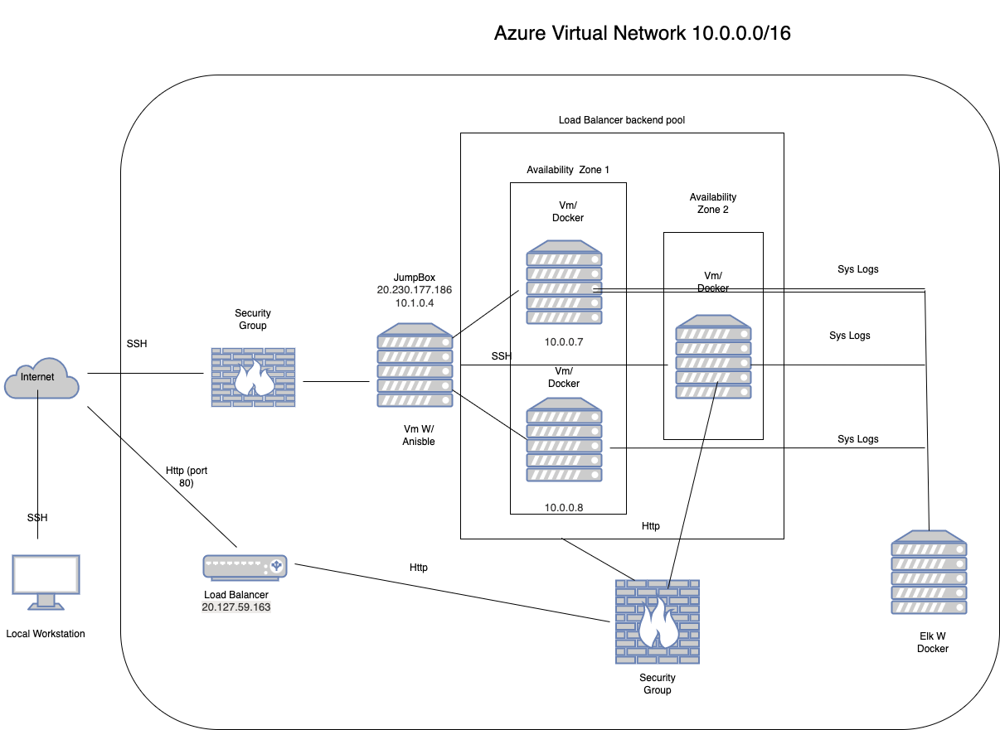
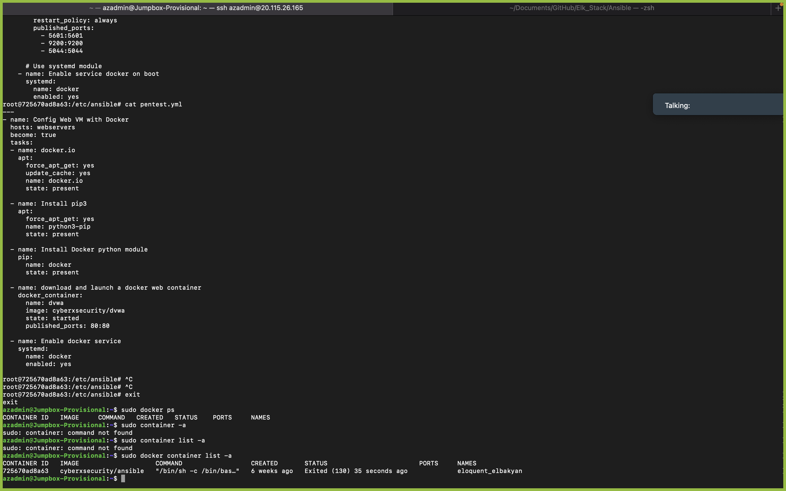

## Automated ELK Stack Deployment

The files in this repository were used to configure the network depicted below.



These files have been tested and used to generate a live ELK deployment on Azure. They can be used to either recreate the entire deployment pictured above. Alternatively, select portions of the _YAML____ file may be used to install only certain pieces of it, such as Filebeat.

  - - name: Config Web VM with Docker
  hosts: webservers
  become: true
  tasks:
  - name: docker.io
    apt:
      force_apt_get: yes
      update_cache: yes
      name: docker.io
      state: present

  - name: Install pip3
    apt:
      force_apt_get: yes
      name: python3-pip
      state: present

  - name: Install Docker python module
    pip:
      name: docker
      state: present

  - name: download and launch a docker web container
    docker_container:
      name: dvwa
      image: cyberxsecurity/dvwa
      state: started
      restart_policy: always
      published_ports: 80:80

  - name: Enable docker service
    systemd:
      name: docker
      enabled: yes
```


```
---
- name: Configure Elk VM with Docker
  hosts: elk
  remote_user: azureuser
  become: true
  tasks:
     Use apt module
    - name: Install docker.io
      apt:
        update_cache: yes
        force_apt_get: yes
        name: docker.io
        state: present

       Use apt module
    - name: Install pip3
      apt:
        force_apt_get: yes
        name: python3-pip
        state: present

       Use pip module (It will default to pip3)
    - name: Install Docker pyhon module
      pip:
        name: docker
        state: present

       Use command module
    - name: Increase virtual memory
      command: sysctl -w vm.max_map_count=262144

       Use sysctl module
    - name: Use more memory
      sysctl:
        name: vm.max_map_count
        value: 262144
        state: present
        reload: yes

       Use docker_container module
    - name: download and launch a docker elk container
      docker_container:
        name: elk
        image: sebp/elk:761
        state: started
        restart_policy: always
         Please list the ports that ELK runs on
        published_ports:
          -  5601:5601
          -  9200:9200
          -  5044:5044
        #5601 is kibana port
        #9200 is elasticsearch
        #5044 is logstash

       Use systemd module
    - name: Enable service docker on boot
      systemd:
        name: docker
        enabled: yes
 ```
 

```
---
- name: Installing and Launch Filebeat
  hosts: webservers
  become: yes
  tasks:
     Use command module
  - name: download filebeat .deb file
    command: curl -L -O https://artifacts.elastic.co/downloads/beats/filebeat/filebeat-7.6.1-amd64.deb

     Use command module
  - name: install filebeat .deb
    command: dpkg -i filebeat-7.6.1-amd64.deb

     Use copy module
  - name: drop in filebeat.yml
    copy:
      src: /etc/ansible/files/filebeat-config.yml
      dest: /etc/filebeat/filebeat.yml

     Use command module
  - name: enable and configure system module
    command: filebeat modules enable system

     Use command module
  - name: setup filebeat
    command: filebeat setup

     Use command module
  - name: start filebeat service
    command: service filebeat start

  - name: enable service filebeat on boot
    systemd:
      name: filebeat
      enabled: yes
```


```
---
- name: Install metric beat
  hosts: webservers
  become: true
  tasks:
     Use command module
  - name: Download metricbeat
    command: curl -L -O https://artifacts.elastic.co/downloads/beats/metricbeat/metricbeat-7.6.1-amd64.deb

     Use command module
  - name: install metricbeat
    command: dpkg -i metricbeat-7.6.1-amd64.deb

     Use copy module
  - name: drop in metricbeat config
    copy:
      src: /etc/ansible/files/metricbeat-config.yml
      dest: /etc/metricbeat/metricbeat.yml

     Use command module
  - name: enable and configure docker module for metric beat
    command: metricbeat modules enable docker

     Use command module
  - name: setup metric beat
    command: metricbeat setup

     Use command module
  - name: start metric beat
    command: service metricbeat start

     Use systemd module
  - name: enable service metricbeat on boot
    systemd:
      name: metricbeat
      enabled: yes

This document contains the following details:
- Description of the Topologu
- Access Policies
- ELK Configuration
  - Beats in Use
  - Machines Being Monitored
- How to Use the Ansible Build


### Description of the Topology

The main purpose of this network is to expose a load-balanced and monitored instance of DVWA, the D*mn Vulnerable Web Application.

Load balancing ensures that the application will be highly available, in addition to restricting __inbound___ to the network.
A load balancer intelligently distributes traffic from clients across multiple servers without the clients having to understand how many servers are in use or how they are configured. Because the load balancer sits between the clients and the servers it can enhance the user experience by providing additional security (DoS attack counter), performance, and resiliency.
- What is the advantage of a jump box?
A jump box is a secure computer that all admins first connect to before launching any administrative task or use as an origination point to connect to other servers or untrusted environments.


Integrating an ELK server allows users to easily monitor the vulnerable VMs for changes to the _jumpbox provisional_and system _network_.
 What does Filebeat watch for? large files of locations you specify 
 What does Metricbeat record? It collects metric data periodically from target servers this could be operating system metrics or monitor other beats and ELK stack itself.

The configuration details of each machine may be found below.


| Name     | Function | IP Address | Operating System |
|----------|----------|------------|------------------|
| Jump Box | Gateway  | 10.0.0.1   | Linux            |
| Web 1   | Webservers| 20.127.59.163|  Linux         |
| Web 2    | Webserver| 20.127.59.163|    Linux       |
| Elk Server| Monitoring|20.230.177.186|    Linux     |

### Access Policies

The machines on the internal network are not exposed to the public Internet. 

Only the _Jumpbox Provisional ___ machine can accept connections from the Internet. Access to this machine is only allowed from the following IP addresses:
 Add whitelisted IP addresses.  My personal IP address

Machines within the network can only be accessed by _Jumpbox Provisional____.
Which machine did you allow to access your ELK VM? What was its IP address?_ My personal Machince/ Jumpbox provisonal : 20.115.26.165

A summary of the access policies in place can be found in the table below.

| Name     | Publicly Accessible | Allowed IP Addresses |
|----------|---------------------|----------------------|
| Jump Box | Yes            |        MY personal IP     |
|  Web 1   |     No         |         10.0.0.6          |
|   Web 2  |     No         |         10.0.0.6          |
|  Elk     |        No      |      My IP ; 5601/10.0.0.6|

### Elk Configuration

Ansible was used to automate configuration of the ELK machine. No configuration was performed manually, which is advantageous because...
- Ansible was used to automate configuration of the ELK machine. Automating server provisioning can eliminate mistakes, and it also allows automation and sequential execution of independent steps.

The playbook implements the following tasks:
- Installation of docker.io to ELK Machine
- Installs pip3 to the ELK Machine
- Installation of the docker python module
- 
The following screenshot displays the result of running `docker ps` after successfully configuring the ELK instance.



### Target Machines & Beats
This ELK server is configured to monitor the following machines:

|Web 1   | Webservers| 20.127.59.163|
| Web 2    | Webserver| 20.127.59.164|  
| Elk Server| Monitoring|20.230.177.186|    


We have installed the following Beats on these machines:
- Filebeat
- Metricbeat

These Beats allow us to collect the following information from each machine:
- Filebeat monitors the logs or locations specified, collects data, and sends it to the ELK server 
- Metricbeat periodically collects metric data from the targets server, it is also used to monitor. Then it takes the metric and statistics that was collected and sent to the specific output such like Logstash for example.

### Using the Playbook
In order to use the playbook, you will need to have an Ansible control node already configured. Assuming you have such a control node provisioned: 

SSH into the control node and follow the steps below:
- Copy the _playbook____ file to __/etc/ansible___.
- Update the _configuration____ file to include...
- Run the playbook, and navigate to __elk server's public IP __ to check that the installation worked as expected.


- _Which file is the playbook? Where do you copy it?_ To your Web VM's
- _Which file do you update to make Ansible run the playbook on a specific machine? Config Line.  How do I specify which machine to install the ELK server on versus which to install Filebeat on?_ Specified in the config file  
- _Which URL do you navigate to in order to check that the ELK server is running?
It will be on the filebeat installtion page on the elk server 
_As a **Bonus**, provide the specific commands the user will need to run to download the playbook, update the files, etc._
